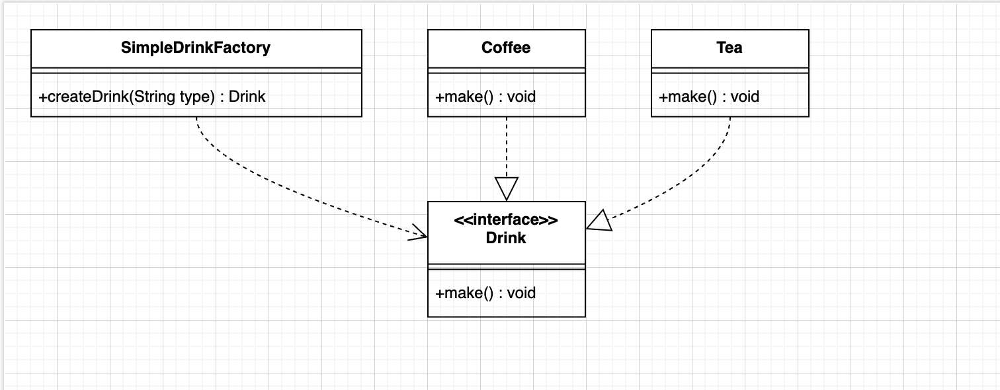
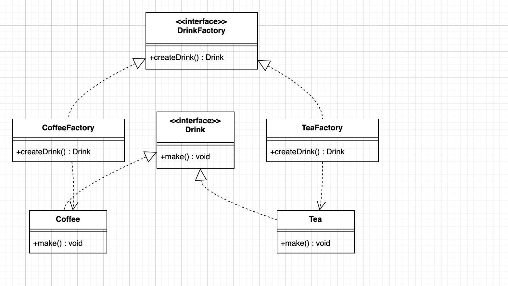
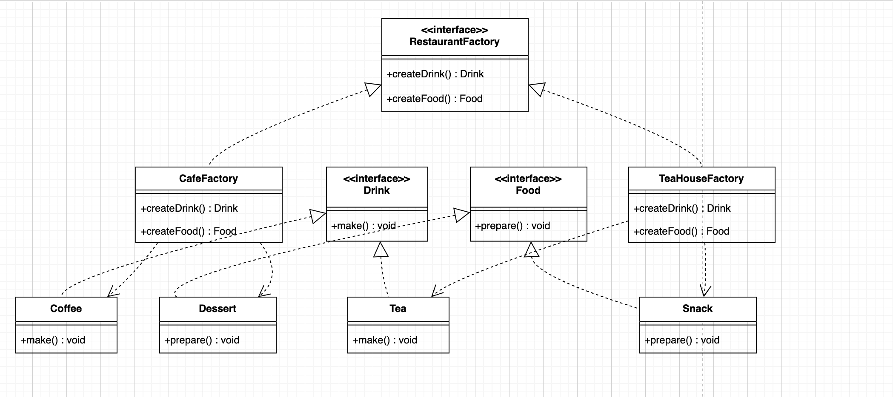

# Java 工厂模式示例

这个项目展示了三种工厂设计模式的实现：简单工厂、工厂方法和抽象工厂。

## 项目结构

```
src/main/java/com/github/xdli/
├── App.java
├── factory
    ├── simple
    │   ├── Drink.java          # 饮料接口
    │   ├── Coffee.java         # 具体产品：咖啡
    │   ├── Tea.java           # 具体产品：茶
    │   └── SimpleDrinkFactory.java  # 简单工厂类
    ├── method
    │   ├── DrinkFactory.java   # 工厂接口
    │   ├── CoffeeFactory.java  # 具体工厂：咖啡工厂
    │   └── TeaFactory.java     # 具体工厂：茶工厂
    └── abstract_factory
        ├── Food.java           # 食物接口
        ├── Dessert.java        # 具体产品：甜点
        ├── Snack.java          # 具体产品：小吃
        ├── RestaurantFactory.java  # 抽象工厂接口
        ├── CafeFactory.java    # 具体工厂：咖啡厅
        └── TeaHouseFactory.java    # 具体工厂：茶馆
```

## 设计模式类图

### 1. 简单工厂模式



- 核心特点：一个工厂类负责创建所有产品
- 实现方式：通过参数类型来决定创建什么产品
- 应用场景：产品种类较少且相对稳定的情况

### 2. 工厂方法模式



- 核心特点：每个产品对应一个专门的工厂类
- 实现方式：将对象的创建延迟到子类中进行
- 应用场景：需要灵活扩展产品种类的情况

### 3. 抽象工厂模式



- 核心特点：创建一系列相关的产品族
- 实现方式：一个工厂可以创建多个相关的产品
- 应用场景：需要创建一组相关产品的情况

## 代码示例

### 简单工厂示例

```java
// 创建饮料的简单方式
Drink coffee = SimpleDrinkFactory.createDrink("coffee");
coffee.make();  // 输出：制作咖啡
```

### 工厂方法示例

```java
// 使用专门的工厂创建产品
DrinkFactory coffeeFactory = new CoffeeFactory();
Drink coffee = coffeeFactory.createDrink();
coffee.make();  // 输出：制作咖啡
```

### 抽象工厂示例

```java
// 创建一组相关的产品
RestaurantFactory cafe = new CafeFactory();
Drink drink = cafe.createDrink();  // 创建咖啡
Food food = cafe.createFood();     // 创建甜点
drink.make();    // 输出：制作咖啡
food.prepare();  // 输出：准备甜点
```

## 运行示例

运行 `App.java` 的 main 方法可以看到三种工厂模式的演示效果：

1. 简单工厂模式：通过一个工厂类集中管理对象的创建
2. 工厂方法模式：将对象的创建委托给具体的工厂类
3. 抽象工厂模式：创建一系列相关的对象家族

## 输出示例

```
===简单工厂模式===
制作咖啡
制作茶

===工厂方法模式===
制作咖啡
制作茶

===抽象工厂模式===
制作咖啡
准备甜点
制作茶
准备小吃
```

## 三种工厂模式的对比

### 简单工厂

- 优点：
  - 实现简单，使用方便
  - 客户端无需知道具体产品类
- 缺点：
  - 违反开闭原则
  - 工厂类职责过重

### 工厂方法

- 优点：
  - 符合开闭原则
  - 单一职责原则
- 缺点：
  - 类的数量增加
  - 系统复杂度增加

### 抽象工厂

- 优点：
  - 产品族一致性
  - 易于切换产品族
- 缺点：
  - 扩展困难
  - 产品族扩展需要修改接口

## 使用建议

1. 如果产品种类较少且相对稳定，使用简单工厂
2. 如果需要经常扩展产品种类，使用工厂方法
3. 如果需要创建一系列相关产品，使用抽象工厂

## 项目依赖

```xml
<dependencies>
    <dependency>
        <groupId>junit</groupId>
        <artifactId>junit</artifactId>
        <version>4.11</version>
        <scope>test</scope>
    </dependency>
</dependencies>
```
